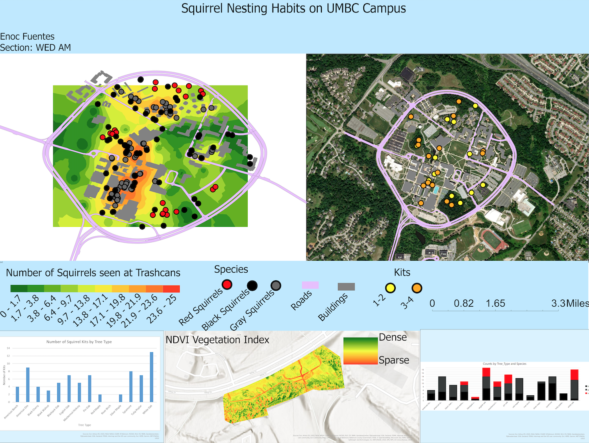
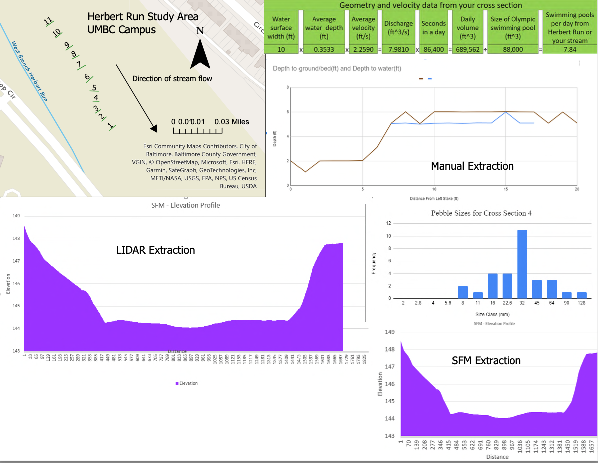
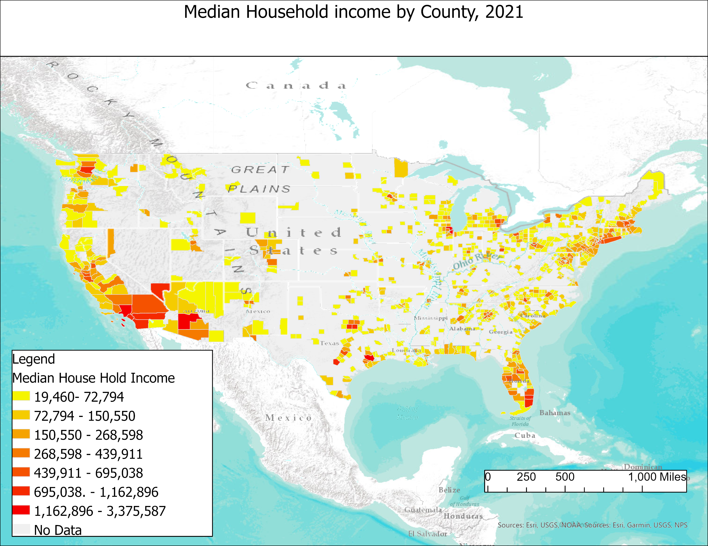
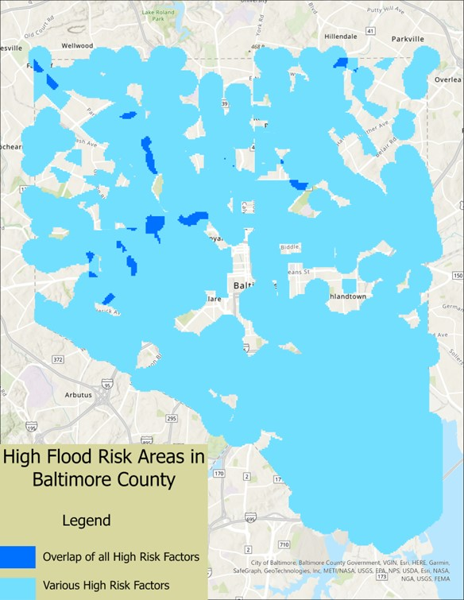
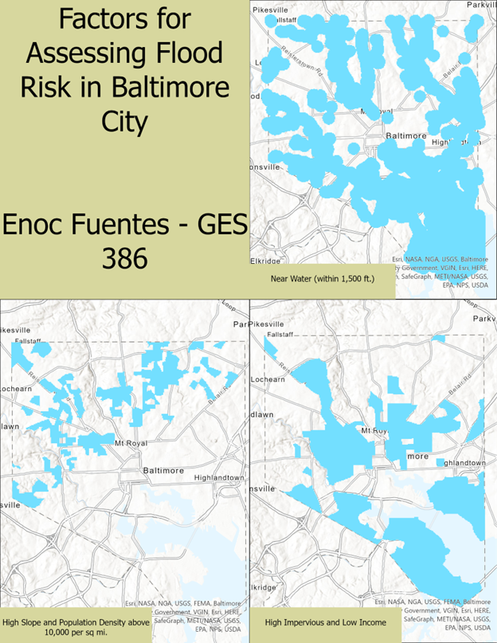

# Enoc Fuentes
I am a Geography and Environmental Science student at UMBC and a Facilty Steward at Locust Grove Nature Center. This website showcases the various ArcGIS projects I have completed.

# Analyzing Squirrel Nesting Habits on UMBC Campus
*Completed December 2022*
* Collected trailcam data and mapped squirrel activity and nesting habits in various locations around UMBC campus 

## Code and Resources Used:
**Software:** Arc GIS  
**Version:** 10.6  

# Project 6: My sixth GIS Project
*Completed June 2022*
* mapped and analyzed things that exist and events that happen on Earth
* more description
* more description

## Code and Resources Used:
**Software:** Arc GIS  
**Version:** 10.6  

# Project 7: My seventh GIS Project
*Completed June 2022*
* mapped and analyzed things that exist and events that happen on Earth
* more description
* more description

## Code and Resources Used:
**Software:** Arc GIS  
**Version:** 10.6  

# Project 8: My sixth GIS Project
*Completed June 2022*
* mapped and analyzed things that exist and events that happen on Earth

# Analyzing Flood Risk in Baltimore City 
*Completed June 2022*
* Mapped various risk factors that contribute to flooding and overlayed the resulting maps to determing areas in Baltimore city that are prone to flooding.

