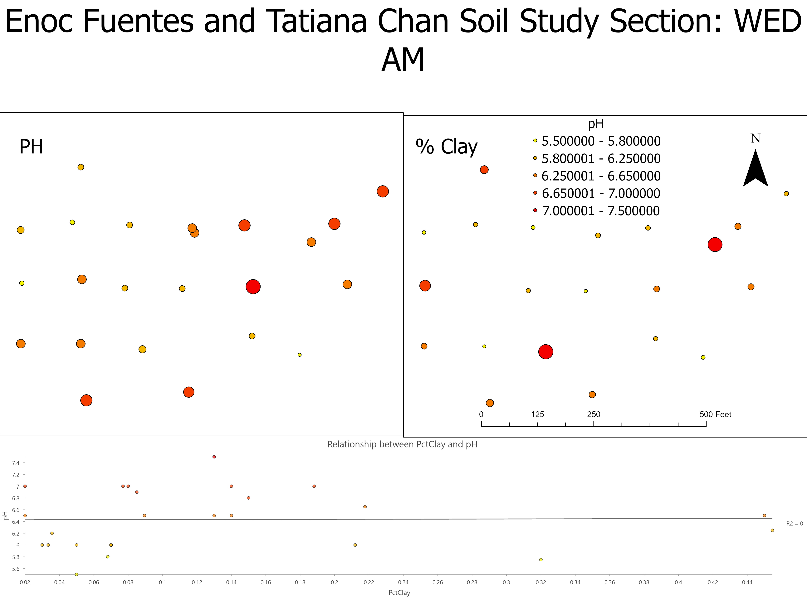

# enocsportfolio.github.io
I am experienced in... I attended ... I worked with...
 
# Project 1: My first GIS Project
*Completed December 2022*
* mapped and analyzed things that exist and events that happen on Earth
* more description
* more description

## Code and Resources Used:
**Link to code:** [Project Title](https://www.google.com)  
**Software:** Arc GIS  
**Version:** 10.6  
**Packages:** Package 1, Package 2  

# Project 2: My second GIS Project
*Completed June 2022*
* mapped and analyzed things that exist and events that happen on Earth
* more description
* more description

.png)

## Code and Resources Used:
**Link to code:** [Project Title](https://www.google.com)  
**Software:** Arc GIS  
**Version:** 10.6  
**Packages:** Package 1, Package 2  
