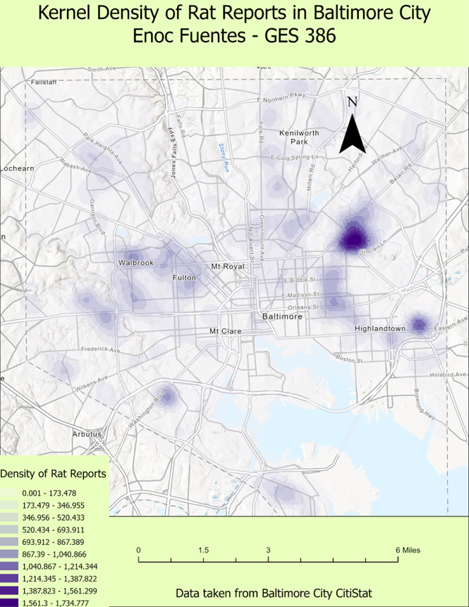
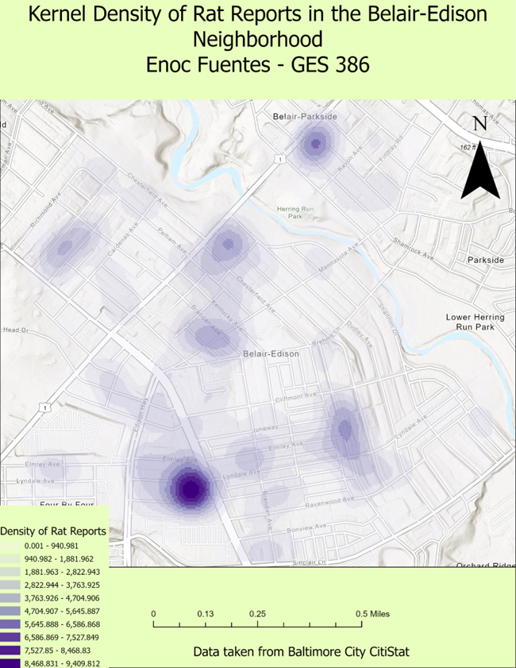

# Enoc Fuentes
I am a Geography and Environmental Science student at UMBC and a Facilty Steward at Locust Grove Nature Center. 
I have experience with ArcGIS, ArcGIS Online, and QGIS. I am also Profiecient in SQL, Java, and R.
This website showcases the various ArcGIS projects I have completed.

# Analyzing Squirrel Nesting Habits on UMBC Campus
*Completed December 2022*
* Mapped and analyzed squirrel activity and nesting habits using trailcam data in various locations around UMBC campus. 

## Software Used:
**Software:** Arc GIS  
**Version:** 10.6  

# Stream Study of Herbert Run in Baltimore County
*Completed December 2022*
* Used Lidar and SFM point cloud data along with traditional flow rate measurment methods to analyze the flow and dimensions of a portion of Herbert Run.

## Software Used:
**Software:** Arc GIS  
**Version:** 10.6  

# Choropleth Map of Median Household Income in the United States
*Completed March 2023*
* Used Census data and join functions in ArcGIS to create a chloropleth map of Median Household Income through the United States

## Software Used:
**Software:** Arc GIS  
**Version:** 10.6  

# NDVI Vegetation Density Mapping
*Completed June 2022*
* Used infared imagery to create a Normalized Difference Vegetation Index of various sites around UMBC.
 

# Analyzing Flood Risk in Baltimore City 
*Completed June 2022*
* Mapped various risk factors that contribute to flooding and overlayed the resulting rasters using rater calculation to determine areas in Baltimore city that are prone to flooding.

## Software Used:
**Software:** Arc GIS  
**Version:** 10.6  

# Remote Sensing with Weather Ballons and Georeferencing to create an NDVI
*Completed March 2023*
* Used infared cameras attached to weather ballons to create a georeferenced photo mosaic that was used to create a Normalized Difference Vegetation Index.

## Software Used:
**Software:** Arc GIS  
**Version:** 10.6  

# Kernel Density Mapping of Rat Sightings in Baltimore City
*Completed March 2023*
* Used the Kernel method for density mapping to visualize concentrations of rat sightings in Baltimore City and the Bel Air Edison Neighborhood

## Software Used:
**Software:** Arc GIS  
**Version:** 10.6  
